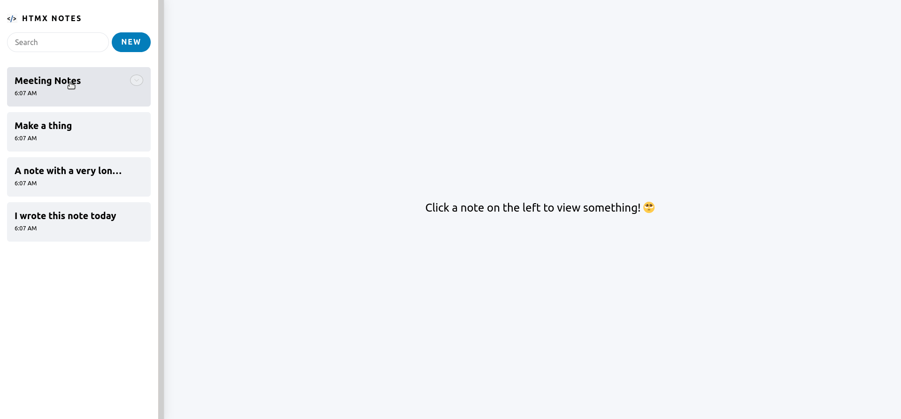

# htmx-notes

This is a demo note-taking app using markdown inspired by the [React Server Components demo](https://github.com/reactjs/server-components-demo) written using 
[htmx](https://htmx.org) and [Express.js](https://expressjs.com).

[Demo](https://htmx-notes.herokuapp.com)



## Local development
Clone the git repo, install the dependencies and start the server.
```
git clone https://github.com/rajasegar/htmx-notes
cd htmx-notes
npm install
npm start
```

You can view the demo app in action at `http://localhost:3000`.
